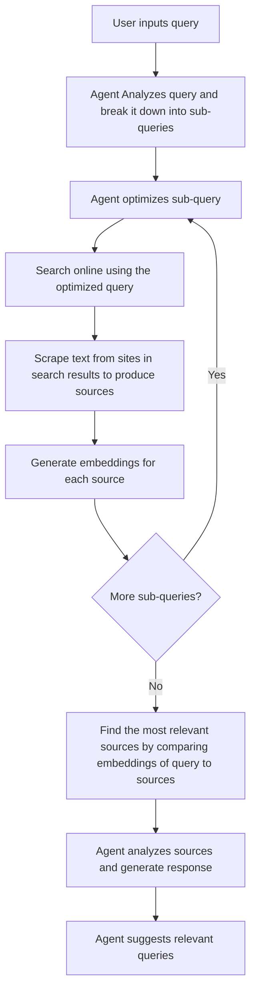

# 🔍 **Lenze:** A search engine inspired by Perplexity AI.

## Features
Lenze is capable of doing:
- Search on web on user's query.
- Retrive summarised information regarding the query.
- Provide sources to each piece of information.
- Suggest relevant queries.

## Framework
Lenze utilises the [Netmind.AI-XYZ](https://github.com/protagolabs/Netmind-AI-XYZ) framework to manipulate multiple agents.

## Agents
Lenze consists of the following agents:

**Analysis Agent:** Analyze the query input from the user and break down a complex query into simpler sub-queries if necessary.

**Search Agent:** Search across the internet on a list of given sub-queries and return a list of sources containing URLs and text content at the URLs.
<br>There are two sub-agents that this agent calls:
- **Optimization Agent:** Optimize the query for most accurate Google search results.
- **Refining Agent:** Refined the search results to exclude irrelevant, redundant and unreliable sources.

**Response Agent:** Analyze the extracted information and generate a concise response to user's query and generate related queries.

## Workflow


## Getting Started
To get started, please create an ```.env``` file in the main directory of this repo.
<br>In the ```.env``` file, please insert the OpenAI API key, Google API key and your Google Custom Search Engine ID as below:
```
OPENAI_API_KEY = Your-OpenAI-API-Key
GOOGLE_API_KEY = Your-Google-API-Key
CSE_ID = Your-Google-CSE-ID
```
